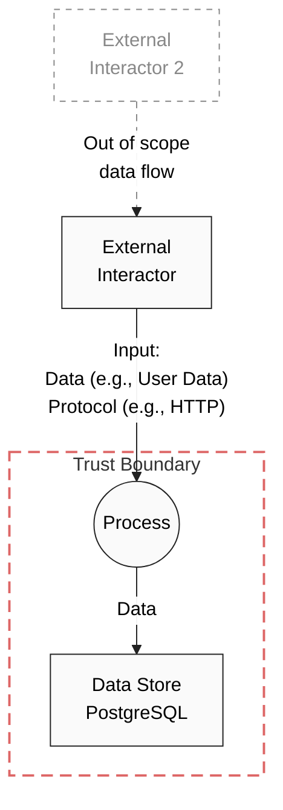

# Security Assessment $PRODUCT

|     |     |
| --- | --- |
| Contact for product        | [@github](https://github.com/github) |
| Security responsible       | [@github](https://github.com/github) |
| Version number of product  |      |
| Dates of assessment        | 1970-01-01: Created DFD |
|                            | 1970-01-10: Discussion of threats |
|                            | 1970-01-25: Finalized assessment  |
| Status of assessment       | DRAFT/FINAL/RE-ASSESSMENT DRAFT |

## Product Description

Short description of the main functionality in two to three sentences.

### Important Links
* E.g., Documentation on GitHub and elsewhere, description of service, old assessments, connected repos

## Existing Security Controls

Primary controls implemented on product (or on specific aspect of product):

* xxx – description
* yyy – description

## Data Flow Diagram (DFD)

Place for additional information on data flows and the data flow diagram. The following list may be used as a guidance and should not be included into the final version of the assessment.

Key Information Needed for DFD:
* Interactor
* Target of Interaction
* Interaction Description
* Session Management (Token, Lifetime, Type, etc.)
* Input Validation Controls
* Availability Controls (e.g. rate limiting, pod resiliency, etc.)
* Zone Type (cloud, container, etc.)
* Access Rights available
* Access Type 
* Sensitive Data in interaction?
* Network Protocol
* Encryption (TLS, algorithm, key length)
* Authentication
* Credential Storage
* Logging

### Changes compared to last Security Assessment

Mention date of last security assessment (if not already done in the header of the document) and changes to the architecture and security controls since the last assessment.

## Threats & Risks
All identified, exploitable threats and risks must be reported via **GitHub security advisories** using the *Security* tab in GitHub. See also SECURITY.md in the root of this repo. Links to GitHub security advisories may be added to this document.

Non-critical threats and findings may be submitted as issues, instead, and should be linked from this document.
