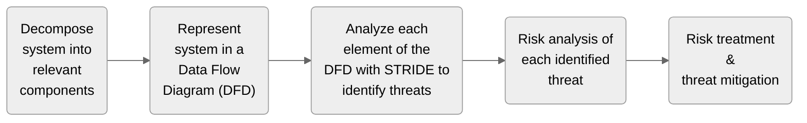
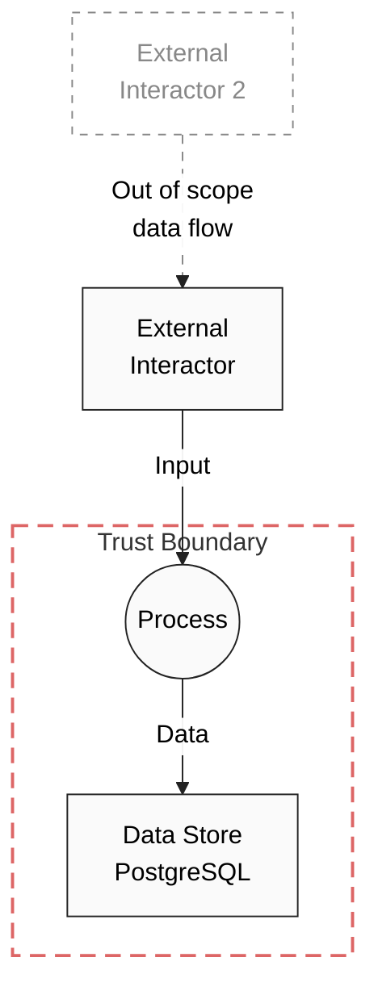

ℹ️ This document describes one specific method of performing security assessments based on data flow diagrams, STRIDE, and risk assessments. Other methods of assessing the security may be used, especially if a project team already has performed security assessment in the past.

## TL;DR for Security Assessments within Tractus-X

1. Each Tractus-X project which undergoes a security assessment should have a `security-assessment.md` file stored in the documentation subfolder (`/docs`) of the repo.  
A template for this file can be found at [`security-assessment-template.md`](security-assessment-template.md).
2. The file `security-assessment.md` should contain a Data Flow Diagram (DFD).
If there is no existing diagram showing the architecture and/or data flows, the following template may be used: [mermaid.js Template to use for DFD within Tractus-X](#mermaidjs-template-to-use-for-dfd-within-tractus-x)
3. `security-assessment.md` should contain a list of existing security controls.
4. A [risk analysis](#risk-analysis) must be done.
The risk analysis must not be documented publicly while any risks rated moderate or higher are present.
5. Any identified, exploitable threats and their corresponding risk level must be submitted as Security Advisories within the respective GitHub repository (Security tab).
They must not be made public before a mitigation is in place.  
Non-critical threats and findings may be submitted as issues, instead.

## Workflow

The security assessment describes a detailed threat modeling process based on STRIDE.



All information, including the DFD as well as all supporting information necessary for the security assessment, must be stored in a file called `security-assessment.md` in the documentation-subfolder of each repo that is assessed.
A template for this file can be found at [`security-assessment-template.md`](security-assessment-template.md).

## Data Flow Diagram (DFD)

Having a good diagram is key to a good threat model.

The first step is to draw a diagram of the flow of data in your component.
It’s the DATA flow you care about, NOT the code flow.
Your threats come via data, NOT code.

Use the following elements:

<table>
  <tr>
    <th align="left">Element
    <th align="left">Description
    <th align="left">Modeling in mermaid.js

  <tr>
    <th align="left">(External) Interactor
    <td>An element that is outside your area of control.
    It could be a user calling into an API, it could be another component (browser, user) but not one that’s being threat modeled.
    In general, interactors are the endpoint of the system and enter or extract data.
    <td>

    ext_interactor["External \n Interactor"]

  <tr>
    <th align="left">Process
    <td>A process is simply some code (or microservice).
    It does NOT mean that it’s a “process” as OS’s call processes, instead it’s just a collection of code.
    <td>

    process(("Process"))

  <tr>
    <th align="left">Data Store
    <td>A data store is something that holds data.
    In the DFD, there shouldn’t be any data sinks – all data gets read.
    Also, data (usually) gets created by an interactor.
    <td>

    data_store[|borders:tb|"Data Store \n PostgreSQL"]

  <tr>
    <th align="left">Data Flow
    <td>Represents the flow of data through the system.
    Data always flows from an interactor via a process to a store – or vice versa.
    <td>

    process -- "Data" --> data_store

  <tr>
    <th align="left">Trust Boundary
    <td>Occurs when one component doesn’t trust the component on the other side of the boundary.
    There is always a trust boundary between elements running at different privilege levels.
    <td>

    subgraph "Trust Boundary"
        process(("Process"))
        data_store[|borders:tb|"Data Store \n PostgreSQL"]
        process -- "Data" --> data_store
    end

  <tr>
    <th align="left">Out of Scope Elements
    <td>Sometimes it makes sense to add elements that are necessary for understanding the data flows but are irrelevant to the security assessments.
    These are marked as out of scope by being grayed out and dashed.
    <td>

    ext_interactor2["External \n Interactor 2"]:::oos
    ext_interactor2 -. "Out of scope data flow" .-> ext_interactor

```mermaid
%% ----------------------
%% -- BEST PRACTICES ----
%% ----------------------
%% .
%% === OUT OF SCOPE ====
%% mark out of scope elements with ":::oos", e.g., backend_process(("Backend")):::oos
%% mark out of scope data flows as dotted links, e.g., A -. "text" .-> B
%% .
%% === MOVING STUFF AROUND ====
%% Use hidden links to force mermaid.js to reposition some elements, e.g., A ~~~ B
%% Use hidden subgraphs to position elements closely together by naming the subgraph `_hidden`
%%     subgraph _hidden
%%       process((Process))
%%       interactor[Interactor]
%%       process --> interactor
%%     end
%% For nested, hidden subgraphs, use: _hidden, _hidden1, _hidden2, _hidden3

%% ----------------------
%% -- START DFD ---------
%% ----------------------
flowchart LR
%% replace `flowchart` with `flowchart LR` for a left-to-right oriented flowchart

  ext_interactor["External \n Interactor"]
  ext_interactor2["External \n Interactor 2"]:::oos

  subgraph "Trust Boundary"
    direction TB
    process(("Process"))
    data_store[|borders:tb|"Data Store \n PostgreSQL"]
  end
  process -- "Data" --> data_store

  ext_interactor -- "Input:\nData (e.g., User Data)\nProtocol (e.g., HTTP)" --> process
  ext_interactor2 -. "Out of scope \n data flow" .-> ext_interactor

%% ----------------------
%% -- END DFD -----------
%% ----------------------

classDef cluster fill:transparent,stroke:#d66,stroke-width:2px,stroke-dasharray: 10 6;
classDef node fill:#fafafa,stroke:#222;
classDef edgeLabel background-color:#ffffffaa,display:inline-block;
classDef oos fill:#fff,stroke:#888,color:#888,stroke-dasharray: 5 5,stroke-width:1px;
linkStyle default stroke:#222,stroke-width:1px;
%%{init:{'theme':'neutral', 'themeCSS':'#_hidden,#_hidden1,#_hidden2,#_hidden3{display:none;}.edge-pattern-dotted{stroke:#888!important;stroke-width:1px!important;stroke-dasharray: 6 5!important;}'}}%%
```

</table>



### Is the DFD sensible?

Source: [Microsoft: Uncover Security Design Flaws Using The STRIDE Approach](https://learn.microsoft.com/en-us/archive/msdn-magazine/2006/november/uncover-security-design-flaws-using-the-stride-approach)

1. Be careful of magic data sources or sinks: data isn’t created out of thin air.
Make sure you **have a user represented as a reader or writer for each data store**.
2. Beware of psychokinesis as a data transport.
In other words, **make sure there is always a process that reads and writes data**.
It doesn’t go directly from a user’s head to the disk, or vice versa.
3. **Collapse similar elements within a single trust boundary** into a single element for modeling purposes.
If they are implemented in the same technology and are contained within the same trust boundary, you may be able to collapse them.
4. Be careful when modeling details on either side of a trust boundary.
The temptation is to model things on both sides of a trust boundary simultaneously.
It’s good practice to have a context DFD and breakout diagrams that show more detail.

### mermaid.js Template to use for DFD within Tractus-X

Use the following template to include a data flow diagram into a markdown file, rendered by GitHub as a graphical diagram.
Enter the actual DFD code between the `START DFD` and `END DFD` tags.

See a working example at the end of the document.


````

````

## STRIDE

STRIDE stands for “Spoofing”, “Tampering”, “Repudiation”, “Information disclosure”, “Denial of service”, and “Elevation of privilege”.

<table>
  <tr>
    <th align="left">Threat
    <th align="left">Property
    <th align="left">Definition
  <tr>
    <th align="left">Spoofing
    <td>Authentication
    <td>Impersonating something or someone else
  <tr>
    <th align="left">Tampering
    <td>Integrity
    <td>Modifying data or code
  <tr>
    <th align="left">Repudiation
    <td>Non-repudiation
    <td>Claiming to have not performed an action
  <tr>
    <th align="left">Information Disclosure
    <td>Confidentiality
    <td>Exposing information to someone not authorized to see it
  <tr>
    <th align="left">Denial of Service
    <td>Availability
    <td>Deny or degrade service to users
  <tr>
    <th align="left">Elevation of Privilege
    <td>Authorization
    <td>Gain capabilities without proper authorization
</table>

There is a lot of overlap between the six categories (e.g., a successful *elevation of privilege* attack could result in *tampering* of data).
Thus, the STRIDE categories can be understood as a tool for supporting the developer and security reviewer while discussing security measures and threats.

### STRIDE-per-Element

For each element type, the following threats are considered valid:

<table>
<tr>
  <th align="left">Element
  <th title="Spoofing" align="center">S
  <th title="Tampering" align="center">T
  <th title="Repudiation" align="center">R
  <th title="Information Disclosure" align="center">I
  <th title="Denial of Service" align="center">D
  <th title="Elevation of Privilege" align="center">E
<tr>
  <td>External Interactors
  <td title="Spoofing" align="center">✔️
  <td>
  <td title="Repudiation" align="center">✔️
  <td>
  <td>
  <td>
<tr>
  <td>Processes
  <td title="Spoofing" align="center">✔️
  <td title="Tampering" align="center">✔️
  <td title="Repudiation" align="center">✔️
  <td title="Information Disclosure" align="center">✔️
  <td title="Denial of Service" align="center">✔️
  <td title="Elevation of Privilege" align="center">✔️
<tr>
  <td>Data Stores
  <td>
  <td title="Tampering" align="center">✔️
  <td title="Repudiation" align="center">❓
  <td title="Information Disclosure" align="center">✔️
  <td title="Denial of Service" align="center">✔️
  <td>
<tr>
  <td>Data Flows
  <td>
  <td title="Tampering" align="center">✔️
  <td>
  <td title="Information Disclosure" align="center">✔️
  <td title="Denial of Service" align="center">✔️
  <td>
</table>

> ❓: Only applicable when logs are stored in data store.

We call this process of considering the element-specific threats to each element in the DFD “STRIDE-per-Element”.

And the best part about it is that STRIDE/element allows people to produce competent threat models with relatively little training.

The STRIDE-per-element methodology ends up creating a fair number of threats, even a component with a relatively tiny diagram.
The good news is that many/most of those threats aren’t meaningful threats and can be discarded.

## Risk Analysis

For each threat, the risk must be determined.
The defined risk assessment methodology can be used for this purpose.

Risk is composed both of the impact when a risk is manifested and the likelihood that the risk will manifest.
Impact can be assessed in a risk assessment and is primarily based on the data which the service handles.
Likelihood on the other hand is primarily driven by the presence or absence of security controls in the service.

Risk is commonly defined as: **risk = impact × likelihood**

### Impact

Source: [Mozilla: Assessing Security Risk](https://infosec.mozilla.org/guidelines/assessing_security_risk)

Assessing impact is a relatively finite, quantitative exercise.
When imagining a threat scenario, attacks, etc. we can define the maximum amount of how much money we might lose, or how badly our reputation would be damaged, how many employees would be unable to work, etc.

Risk impact generally does not change quickly over time unless services and products are redesigned, large features are added, new types of data are processed, etc.

Source: [Mitre Common Weakness Scoring System, Technical Impact](https://cwe.mitre.org/cwss/cwss_v1.0.1.html#2.3.1)

<table>
  <tr>
    <th align="left">Value
    <th align="left">Description
  <tr>
    <th align="left">⬜&nbsp;None
    <td>There is no technical impact to the software being analyzed at all.
    In other words, this does not lead to a vulnerability.
  <tr>
    <th align="left">🟩&nbsp;Low
    <td>Minimal control over the software being analyzed, or only access to relatively unimportant information can be obtained.
  <tr>
    <th align="left">🟨&nbsp;Moderate
    <td>Moderate control over the software being analyzed, or access to moderately important information can be obtained.
  <tr>
    <th align="left">🟥&nbsp;High
    <td>Significant control over the software being analyzed, or access to critical information can be obtained.
  <tr>
    <th align="left">🟪&nbsp;Critical
    <td>Complete control over the software being analyzed, to the point where operations cannot take place.
</table>

### Likelihood

Source: [Mozilla: Likelihood Indicators](https://infosec.mozilla.org/guidelines/risk/likelihood_indicators)

The likelihood indicator for a given security control is the likelihood that a vulnerability in the service will be exploited in a calendar year due to the absence of the security control.

<table>
  <tr>
    <th align="left">Value
    <th align="left">Description
  <tr>
    <th align="left">⬜&nbsp;None
    <td>An attacker has no chance of success, i.e., the issue is a “bug” because there is no attacker role, and no benefit to the attacker.
  <tr>
    <th align="left">🟩&nbsp;Low
    <td>The absence of this security control is unlikely to cause a risk to manifest.
    It may cause security incident response to be slower or more difficult.
  <tr>
    <th align="left">🟨&nbsp;Moderate
    <td>The absence of this security control may cause a risk to manifest in the coming year.
    This security control is important but with additional supporting controls may not be required.
  <tr>
    <th align="left">🟥&nbsp;High
    <td>The absence of this security control will probably cause a risk to manifest in the coming year. This security control is important and should only be missing for LOW impact services.
  <tr>
    <th align="left">🟪&nbsp;Critical
    <td>The absence of this security control will cause a risk to manifest in the coming year.
    This security control is required.
</table>

### Risk

Source: [Mozilla: Standard Risk Levels](https://infosec.mozilla.org/guidelines/risk/standard_levels)

<table>
  <tr>
    <th align="left">Value
    <th align="left">Description
  <tr>
    <th align="left">⬜&nbsp;None
    <td>An attacker has no chance of success, i.e., the issue is a “bug” because there is no attacker role, and no benefit to the attacker.
  <tr>
    <th align="left">🟩&nbsp;Low
    <td>

* **Attention:** Expected but not required.
* **Impact:** Low or moderate impact.
* **Effort:** Best effort and best practices expected.
* **Risk acceptance:** Risk may often be accepted as residual risk.
* **Exception time (SLA):** Indefinitely.

</td>
  </tr>
  <tr>
    <th align="left">🟨&nbsp;Moderate
    <td>

* **Attention:** Attention from all concerned parties.
* **Impact:** Low, moderate or high impact.
* **Effort:** Best effort.
Following standard/guidelines is required.
* **Risk acceptance:** Risk should be discussed, and at least mitigated.
* **Exception time (SLA):** Recommend remediation within 90 days.

</td>
  </tr>
  <tr>
    <th align="left">🟥&nbsp;High
    <td>

* **Attention:** Full attention from all concerned parties required.
* **Impact:** Moderate, high or critical impact.
* **Effort:** Some key resources engaged on fixing the issue.
Following standard/guidelines is required.
* **Risk acceptance:** Risk must be discussed and must at least be mitigated.
* **Exception time (SLA):** Recommend remediation within 7 days.

</td>
  </tr>
  <tr>
    <th align="left">🟪&nbsp;Critical
    <td>This is the most important level, where the risk is especially great.

* **Attention:** Full attention from all concerned parties required.
* **Impact:** High or critical impact.
* **Effort:** All resources engaged on fixing issues.
Following standard/guidelines is required.
* **Risk acceptance:** Rarely accepted as residual risk, must be discussed, and must be mitigated or remediated.
* **Exception time (SLA):** Recommend fixing immediately.

</td>
  </tr>

</table>

<table>
  <tr>
    <th colspan="2" rowspan="2">Risk
    <th colspan="5">Likelihood
  <tr>
    <th align="left">⬜&nbsp;None
    <th align="left">🟩&nbsp;Low
    <th align="left">🟨&nbsp;Moderate
    <th align="left">🟥&nbsp;High
    <th align="left">🟪&nbsp;Critical
  <tr>
    <th rowspan="5">Impact
    <th align="left">⬜&nbsp;None
    <td>⬜&nbsp;None
    <td>⬜&nbsp;None
    <td>⬜&nbsp;None
    <td>⬜&nbsp;None
    <td>⬜&nbsp;None
  <tr>
    <th align="left">🟩&nbsp;Low
    <td>⬜&nbsp;None
    <td>🟩&nbsp;Low
    <td>🟩&nbsp;Low
    <td>🟩&nbsp;Low
    <td>🟨&nbsp;Moderate
  <tr>
    <th align="left">🟨&nbsp;Moderate
    <td>⬜&nbsp;None
    <td>🟩&nbsp;Low
    <td>🟨&nbsp;Moderate
    <td>🟨&nbsp;Moderate
    <td>🟥&nbsp;High
  <tr>
    <th align="left">🟥&nbsp;High
    <td>⬜&nbsp;None
    <td>🟨&nbsp;Moderate
    <td>🟥&nbsp;High
    <td>🟥&nbsp;High
    <td>🟪&nbsp;Critical
  <tr>
    <th align="left">🟪&nbsp;Critical
    <td>⬜&nbsp;None
    <td>🟨&nbsp;Moderate
    <td>🟥&nbsp;High
    <td>🟪&nbsp;Critical
    <td>🟪&nbsp;Critical
</table>


### Risk Treatment

Effective risk treatment relies on attaining commitment from key practice stakeholders and developing realistic objectives and timelines for implementation.

For each risk identified in the risk assessment, detail the following:

* Specify the treatment option agreed on – avoid, reduce, share/transfer or accept.
* Document the treatment plan – outline the approach to be used to treat the risk.
Any relationships or interdependencies with other risks should also be highlighted.
* Assign an appropriate owner – who is accountable for monitoring and reporting on progress of the treatment plan implementation.
Where the treatment plan owner and the risk owner are different, the risk owner has ultimate accountability for ensuring the agreed treatment plan is implemented.
* Specify a target resolution date – where risk treatments have long lead times, consider the development of interim measures.
For example, it is unlikely to be acceptable for a residual risk to be rated *high* and to have a risk treatment with a resolution timeframe of two years.

### Mitigations
Microsoft provides a list of typical mitigations for various categories of threats:

Source: [Microsoft Threat Modeling Tool mitigations](https://learn.microsoft.com/en-us/azure/security/develop/threat-modeling-tool-mitigations)

<table>
  <tr>
    <th align="left">Category
    <th align="left">Description
  <tr>
    <td>Auditing and Logging
    <td>Who did what and when? Auditing and logging refer to how your application records security-related events
  <tr>
    <td>Authentication
    <td>Who are you? Authentication is the process where an entity proves the identity of another entity, typically through credentials, such as a username and password
  <tr>
    <td>Authorization
    <td>What can you do? Authorization is how your application provides access controls for resources and operations
  <tr>
    <td>Communication Security
    <td>Who are you talking to? Communication Security ensures all communication done is as secure as possible
  <tr>
    <td>Configuration Management
    <td>Who does your application run as? Which databases does it connect to? How is your application administered? How are these settings secured? Configuration management refers to how your application handles these operational issues
  <tr>
    <td>Cryptography
    <td>How are you keeping secrets (confidentiality)? How are you tamper-proofing your data or libraries (integrity)? How are you providing seeds for random values that must be cryptographically strong? Cryptography refers to how your application enforces confidentiality and integrity
  <tr>
    <td>Exception Management
    <td>When a method call in your application fails, what does your application do? How much do you reveal? Do you return friendly error information to end users? Do you pass valuable exception information back to the caller? Does your application fail gracefully?
  <tr>
    <td>Input Validation
    <td>How do you know that the input your application receives is valid and safe? Input validation refers to how your application filters, scrubs, or rejects input before additional processing.
    Consider constraining input through entry points and encoding output through exit points.
    Do you trust data from sources such as databases and file shares?
  <tr>
    <td>Sensitive Data
    <td>How does your application handle sensitive data? Sensitive data refers to how your application handles any data that must be protected either in memory, over the network, or in persistent stores
  <tr>
    <td>Session Management
    <td>How does your application handle and protect user sessions? A session refers to a series of related interactions between a user and your Web application
</table>
