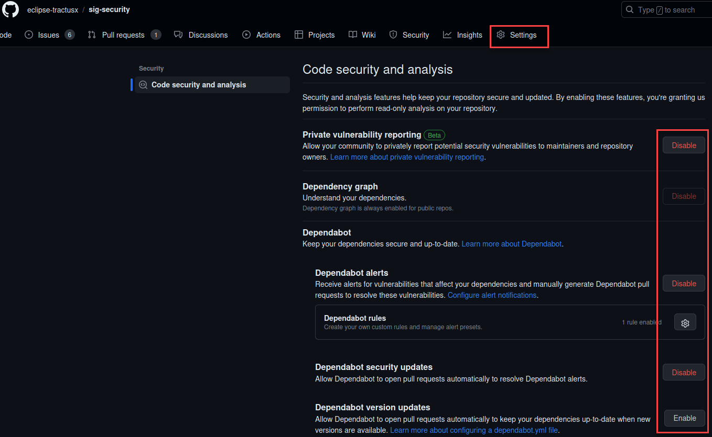

# Security Tooling

These developer-friendly workflows ensure all security findings are directly visible in the GitHub Security tab, keeping everything within the familiar GitHub environment. While using these actions is optional, their implementation is strongly recommended as they introduce a foundational level of security into the development process. This documentation will guide you through their benefits and setup.

## Emphasized Guidelines for Optimizing Security GitHub Actions

Following, here are specific guidelines and best practices for developers:

1. **Action Failures**: Actions should only fail if there is an error with the Action _"Engine"_ itself or if there is a misconfiguration in the workflow. Failures should not occur based solely on high-severity findings.

2. **Manual Execution**: Include the on: workflow_dispatch option in all workflows. This allows you to manually trigger workflows whenever necessary.

3. **Scheduling Workflows**: Workflows should run frequently. Ideally, they should be set to execute once nightly. At a minimum, they should run once per week. Configure the on: schedule option to achieve this frequency.

4. **Exclusions**: Do not exclude files or directories from scans. If false positives are detected, they can be simply ignored. However, when pushing documentation to the main branch, the workflows do not need to be executed. For such cases, configure the exclude option.

5. **Pull Requests (PRs)**: It's not mandatory for workflows to run with every PR. Nonetheless, the Secret Scan is strongly recommended and deemed sufficient.

6. **Target Scanning**: Avoid over-scanning. Focusing on scanning the releases and the main branch from which releases are made is adequate.

7. **Issue Reporting**: Should developers encounter issues during scanning or have questions regarding tool usage, they are encouraged to create an issue in our repository. An appropriate issue template has been provided to streamline this process.

By adhering to these guidelines, developers can efficiently integrate GitHub actions into their workflow, ensuring optimal security without compromising productivity. 

## Security Tool Workflows

In the context of our emphasized guidelines for security tooling with GitHub actions, we highly recommend the utilization of the following tools: **Trivy, KICS, CodeQL, Dependabot,** and **GitGuardian**. The subsequent sections will introduce and detail the usage of each of these tools.

All of these tools are free for public GitHub repositories, and no key is required.

### GitGuardian

GitGuardian is integrated via its GitHub App, enabling automated secret scanning of our codebase. Each pull request (PR) undergoes a scan. If a potential secret is detected, the commit's author receives an immediate email notification. This email contains a temporary link, allowing the author to either report the detected secret or mark it as a false positive, streamlining the review process for software engineers.

### KICS

KICS is an integral tool in our security workflow, specifically targeting infrastructure-as-code (IaC) vulnerabilities. Here's how we've integrated KICS into our process:

- When a push is made to the main branch or once daily (based on a CRON schedule), excluding markdown and text files, the KICS scan is triggered. Additionally, a manual dispatch option is available for on-demand scans.

- The job runs on the latest Ubuntu and requires permissions for reading actions and content, as well as writing security events. Upon initiation, the repository is checked out using the `actions/checkout@v3` action.

- The primary action involves running the KICS scan, which leverages the `checkmarx/kics-github-action@v1.7.0`. The scan focuses on the root directory, and the results are outputted in the SARIF format, stored in the `kicsResults/` directory. Notably, KICS is configured to exit with a status code of 0, regardless of the scan results, unless there's a KICS engine error. Some paths and specific queries are excluded from the scan, and secret scanning is explicitly disabled.

- Subsequently, the SARIF file, which contains the KICS scan results, is uploaded using the `github/codeql-action/upload-sarif@v2` action. This ensures that the findings are made available for review and further analysis in the GitHub environment, aiding engineers in addressing potential vulnerabilities effectively.

```yml
name: Run KICS scan and upload SARIF

on:
  push:
    branches: main
    paths-ignore:
      - "**/*.md"
      - "**/*.txt"
  schedule:
    - cron: "0 0 * * *" # Once a day
  workflow_dispatch:

jobs:
  analyze:
    name: Analyze
    runs-on: ubuntu-latest
    permissions:
      actions: read
      contents: read
      security-events: write

    steps:
      - name: Checkout repo
        uses: actions/checkout@v3

      - name: Run KICS Scan with SARIF result
        uses: checkmarx/kics-github-action@v1.7.0
        with:
          # Scanning directory .
          path: "."
          # When provided with a directory on output_path
          # it will generate the specified reports file named 'results.{extension}'
          # in this example it will generate: kicsResults/results.sarif
          output_path: kicsResults/
          output_formats: "sarif"
          # If you want KICS to ignore the results and return exit status code 0 unless a KICS engine error happens
          ignore_on_exit: results
          # Exclude paths or files from scan
          # exclude_paths: "terraform/gcp/big_data.tf,terraform/azure"
          # Exclude accepted queries from the build
          # exclude_queries: 0437633b-daa6-4bbc-8526-c0d2443b946e
          # No secret scanning
          disable_secrets: true

      - name: Upload SARIF file
        uses: github/codeql-action/upload-sarif@v2
        with:
          sarif_file: kicsResults/results.sarif
```

### Trivy

Trivy stands as our container vulnerability scanner of choice, ensuring the security of our container images by targeting both OS-level and library dependencies. Here's a concise breakdown of the Trivy integration in our workflow:

- The Trivy scan is initiated either on-demand through manual dispatch or based on a CRON schedule, executing once daily. The job is executed on the latest Ubuntu and requires specified permissions: reading actions and content and writing security events.

- The primary step involves the Trivy vulnerability scanner pulling the container image `tractusx/irs-api:latest` from Docker Hub. **Before scanning, it's essential to ensure that the desired image on Docker Hub is correctly configured for the scan.** We recommend always scanning the most recently published image to maintain updated security assessments. Utilizing the `aquasecurity/trivy-action@0.12.0`, the scanner inspects the image for vulnerabilities of types os and library. Results are formatted as SARIF and stored in `trivy-results.sarif`.

- After the scan, results are then uploaded to the GitHub Security tab via the `github/codeql-action/upload-sarif@v2` action, ensuring engineers can efficiently review and address any highlighted vulnerabilities.

```yml
name: "Run Trivy scan and upload SARIF"

on:
  workflow_dispatch:
  schedule:
    - cron: "0 0 * * *" # Once a day

jobs:
  analyze:
    name: Analyze
    runs-on: ubuntu-latest
    permissions:
      actions: read
      contents: read
      security-events: write

    steps:
      # Pull image from Docker Hub and run Trivy vulnerability scanner
      - name: Run Trivy vulnerability scanner
        uses: aquasecurity/trivy-action@0.12.0
        with:
          image-ref: "tractusx/irs-api:latest"
          format: "sarif"
          output: "trivy-results.sarif"
          vuln-type: "os,library"

      - name: Upload Trivy scan results to GitHub Security tab
        uses: github/codeql-action/upload-sarif@v2
        with:
          sarif_file: "trivy-results.sarif"
```

### CodeQL

CodeQL serves as our core code analysis tool (_SAST_), providing deep code introspection for potential security vulnerabilities and other code quality concerns. Below is a technical breakdown of how CodeQL integrates with our CI/CD process:

- The CodeQL scan is triggered upon commits to the main branch, based on a CRON schedule set at 01:36 every Sunday, or when manually initiated.

- Given the range of languages CodeQL can analyze, the workflow leverages a matrix strategy to dynamically adjust runner settings based on the target language. It currently scans `Java, JavaScript, Python`, and `Ruby`, but this list is adjustable depending on the repository's dominant languages. Note: CodeQL supports a broader set of languages including `'cpp', 'csharp', 'go', 'swift'`, among others. **Accordingly, adjustments should be made to the language matrix when different languages are in play.**

The CodeQL analysis consists of several steps:

- Repository Checkout: The repository content is fetched using `actions/checkout@v3`.

- CodeQL Initialization: The `github/codeql-action/init@v2` action initializes the CodeQL tools, setting the target languages and the desired query sets. CodeQL possesses an extensive collection of predefined queries, but developers can specify custom queries if necessary.

- Auto-build: The `github/codeql-action/autobuild@v2` action attempts to build any compiled languages. This auto-build feature can occasionally face issues and may fail, especially with complex build processes or non-standard configurations. If an auto-build failure occurs, developers must manually configure the build process within the workflow. An example is provided in the workflow to guide this manual setup.

- CodeQL Analysis: Post build, CodeQL performs its analysis, examining the codebase for vulnerabilities and other concerns. Results are categorized based on the language of analysis.

In the provided CodeQL workflow, specific queries are used to enhance security analysis: `+security-extended,security-and-quality`. The `+` symbol ensures that these queries are added to the default set, allowing for a comprehensive security analysis. Developers should be aware of these configured queries as they focus on identifying a broad range of vulnerabilities, ensuring robust code security and quality.

```yml
# For most projects, this workflow file will not need changing; you simply need
# to commit it to your repository.
#
# You may wish to alter this file to override the set of languages analyzed,
# or to provide custom queries or build logic.
#
# ******** NOTE ********
# We have attempted to detect the languages in your repository. Please check
# the `language` matrix defined below to confirm you have the correct set of
# supported CodeQL languages.
#
name: "CodeQL"

on:
  push:
    branches: ["main"]
  pull_request:
    # The branches below must be a subset of the branches above
    branches: ["main"]
  schedule:
    - cron: "36 1 * * 0"
  workflow_dispatch:

jobs:
  analyze:
    name: Analyze
    # Runner size impacts CodeQL analysis time. To learn more, please see:
    #   - https://gh.io/recommended-hardware-resources-for-running-codeql
    #   - https://gh.io/supported-runners-and-hardware-resources
    #   - https://gh.io/using-larger-runners
    # Consider using larger runners for possible analysis time improvements.
    runs-on: ${{ (matrix.language == 'swift' && 'macos-latest') || 'ubuntu-latest' }}
    timeout-minutes: ${{ (matrix.language == 'swift' && 120) || 360 }}
    permissions:
      actions: read
      contents: read
      security-events: write

    strategy:
      fail-fast: false
      matrix:
        language: ["java", "javascript", "python", "ruby"]
        # CodeQL supports [ 'cpp', 'csharp', 'go', 'java', 'javascript', 'python', 'ruby', 'swift' ]
        # Use only 'java' to analyze code written in Java, Kotlin or both
        # Use only 'javascript' to analyze code written in JavaScript, TypeScript or both
        # Learn more about CodeQL language support at https://aka.ms/codeql-docs/language-support

    steps:
      - name: Checkout repository
        uses: actions/checkout@v3

      # Initializes the CodeQL tools for scanning.
      - name: Initialize CodeQL
        uses: github/codeql-action/init@v2
        with:
          languages: ${{ matrix.language }}
          # If you wish to specify custom queries, you can do so here or in a config file.
          # By default, queries listed here will override any specified in a config file.
          # Prefix the list here with "+" to use these queries and those in the config file.

          # For more details on CodeQL's query packs, refer to: https://docs.github.com/en/code-security/code-scanning/automatically-scanning-your-code-for-vulnerabilities-and-errors/configuring-code-scanning#using-queries-in-ql-packs
          queries: +security-extended,security-and-quality

      # Autobuild attempts to build any compiled languages (C/C++, C#, Go, Java, or Swift).
      # If this step fails, then you should remove it and run the build manually (see below)
      - name: Autobuild
        # Ensures that the step only runs for languages other than 'javascript', 'ruby' and 'python'
        if: ${{ matrix.language != 'javascript' && matrix.language != 'ruby' && matrix.language != 'python' }}
        uses: github/codeql-action/autobuild@v2

      # ℹ️ Command-line programs to run using the OS shell.
      # 📚 See https://docs.github.com/en/actions/using-workflows/workflow-syntax-for-github-actions#jobsjob_idstepsrun

      #   If the Autobuild fails above, remove it and uncomment the following three lines.
      #   modify them (or add more) to build your code if your project, please refer to the EXAMPLE below for guidance.

      # - run: |
      #     echo "Run, Build Application using script"
      #     ./location_of_script_within_repo/buildscript.sh

      - name: Perform CodeQL Analysis
        uses: github/codeql-action/analyze@v2
        with:
          category: "/language:${{matrix.language}}"
```

### Dependabot

In order to automatically monitor dependencies for known vulnerabilities, incorporating Dependabot into your GitHub workflow is recommended.

For configuration within GitHub, refer to the appended image illustrating the settings that must be adjusted within the GitHub settings tab.



Notably, highlighted buttons should visibly show _"Disable"_ to ensure correct configuration. Additionally, while the lowest button should also be disabled (not applicable in this example repo due to the absence of code), **enabling it allows the specification of a Dependabot config that aligns with the repo setup, addressing the declaration of registries to be scanned for dependencies.** Click _"Enable"_ to open a basic `dependabot.yml` configuration file in the `.github` directory of your repository.

A basic example of a `dependabot.yml` file, demonstrating configurations for `Docker` and `npm` dependencies, is shown below:

```yml
version: 2
updates:
  - package-ecosystem: "docker"
    directory: "/"
    schedule:
      interval: "daily"
  - package-ecosystem: "npm"
    directory: "/"
    schedule:
      interval: "daily"
```

_Dependabot, while effective, is not without its limitations._ In certain scenarios, it may inadequately assess some dependencies. To ensure a more comprehensive scan, other tools like the OWASP Dependency Scan or Google OSV Scanner can be considered. However, a point of caution: integrating these tools into your workflow can be more intricate compared to Dependabot.

Our primary criterion is developer-friendliness, and given the complexity of integration, these tools aren't our top choices. A noteworthy advantage of the OWASP Dependency Scan is its ability to produce SARIF output, a feature not yet available in Google's OSV.
